<picture>
  <source media="(prefers-color-scheme: dark)" srcset="./assets/hero-dark.svg">
  <source media="(prefers-color-scheme: light)" srcset="./assets/hero-light.svg">
  
</picture>

<p align="center">
  
</p>

<p align="center">
  <a href="https://github.com/GabrielVarao?tab=repositories">
    
  </a>
  <a href="mailto:gabrielvarao778@gmail.com">
    
  </a>
  <a href="https://github.com/GabrielVarao">
    
  </a>
</p>

<p align="center">
  
  
</p>

---

## ✦ About Me

```yaml
name: Gabriel Varao
location: Switzerland
education: Electronics Apprentice EFZ
focus:
  - Software Engineering
  - Embedded Systems
  - Cybersecurity
goal: Build clean, reliable and security-minded technical systems
```

I’m an **Electronics Apprentice (EFZ) in Switzerland** with a strong passion for software engineering, embedded systems and cybersecurity.

I enjoy building practical systems where software interacts with **real hardware**, **live data** and **technical workflows**. My work and projects combine embedded development, dashboards, firmware, Linux-based systems and engineering-oriented UI design.

> I like technology that is not only cool, but also clean, useful and technically solid.

---

## ✦ Tech Arsenal

<p align="center">
  
</p>

<p align="center">
  
  
  
  
  
  
</p>

---

## ✦ Featured Projects

<table>
  <tr>
    <td width="50%">
      <h3>Rust Signal Filter Lab</h3>
      <p>Real-time signal simulation and visualization with Rust and Python.</p>
      <p><strong>Stack:</strong> Rust · Python · ZeroMQ · Protobuf · Matplotlib</p>
      <a href="https://github.com/GabrielVarao/sinus_signal_filter">Open Repository →</a>
    </td>
    <td width="50%">
      <h3>Keyboard Calculator</h3>
      <p>Hardware-tested ATmega2560 calculator with keypad input and LCD output.</p>
      <p><strong>Stack:</strong> C · AVR · ATmega2560 · Microchip Studio</p>
      <a href="https://github.com/GabrielVarao/Keyboard-Calculator">Open Repository →</a>
    </td>
  </tr>
  <tr>
    <td width="50%">
      <h3>Stepper Motor Controller</h3>
      <p>Deterministic motion-control firmware with direction and speed control.</p>
      <p><strong>Stack:</strong> C · AVR · FSM · Motor Control</p>
      <a href="https://github.com/GabrielVarao/Schrittmotor">Open Repository →</a>
    </td>
    <td width="50%">
      <h3>Rust Sinus Console</h3>
      <p>Terminal-based sine-wave rendering as a clean Rust console project.</p>
      <p><strong>Stack:</strong> Rust · Cargo · Math Visualization</p>
      <a href="https://github.com/GabrielVarao/sinus_console">Open Repository →</a>
    </td>
  </tr>
</table>

---

## ✦ Work / Experience

### Electronics Apprentice (EFZ) · Zumbach Electronics AG

- Electronics assembly, testing, calibration and technical service
- Development of software dashboards and engineering interfaces
- Work with REST APIs, React, Node.js and real-time sync
- Embedded Linux deployment and troubleshooting
- Firmware development and hardware validation
- Investigation of Yocto and safe update strategies

---

## ✦ Current Focus

```yaml
learning:
  - Secure software development
  - Cybersecurity and defensive engineering
  - Advanced Rust and Linux
  - Applied AI / computer vision

building:
  - Engineering dashboards
  - Embedded and desktop applications
  - Real-time systems
  - A stronger open-source portfolio
```

---

## ✦ GitHub Metrics

<p align="center">
  
  
</p>

<p align="center">
  
</p>

<p align="center">
  
</p>

---

## ✦ Contribution Snake

<p align="center">
  <picture>
    <source media="(prefers-color-scheme: dark)" srcset="https://raw.githubusercontent.com/GabrielVarao/GabrielVarao/output/github-contribution-grid-snake-dark.svg">
    <source media="(prefers-color-scheme: light)" srcset="https://raw.githubusercontent.com/GabrielVarao/GabrielVarao/output/github-contribution-grid-snake.svg">
    
  </picture>
</p>

---

## ✦ Connect

<p align="center">
  <a href="mailto:gabrielvarao778@gmail.com">
    
  </a>
  <a href="https://github.com/GabrielVarao">
    
  </a>
  <a href="https://github.com/GabrielVarao?tab=repositories">
    
  </a>
</p>

<p align="center">
  
</p>
