<picture>
  <source media="(prefers-color-scheme: dark)" srcset="./assets/dark.svg">
  <source media="(prefers-color-scheme: light)" srcset="./assets/light.svg">
  
</picture>

<p align="center">
  <a href="https://github.com/GabrielVarao?tab=repositories">
    
  </a>
  <a href="mailto:gabrielvarao778@gmail.com">
    
  </a>
  <a href="https://github.com/GabrielVarao">
    
  </a>
</p>

<p align="center">
  
  
  
</p>

---

## About Me

I am an **Electronics Apprentice (EFZ) in Switzerland** with a strong focus on software engineering, embedded systems and cybersecurity.

I enjoy building systems where software interacts with real hardware, live data and operational workflows. My projects range from AVR firmware and real-time signal pipelines to monitoring dashboards, desktop engineering tools and embedded Linux deployments.

My engineering approach focuses on:

- clean and maintainable architecture
- practical testing and hardware validation
- real-time visualization and monitoring
- secure and reliable software design
- professional, product-focused interfaces

My long-term goal is to work professionally in cybersecurity and build technology that solves real technical problems.

### Open To

- Open-source collaboration
- Junior software engineering opportunities
- Cybersecurity and secure software projects
- Embedded systems and Linux development
- Applied AI, automation and real-time systems

---

## Tech Stack

### Languages

<p align="left">
  
</p>

### Frontend

<p align="left">
  
</p>

### Backend & Data

<p align="left">
  
</p>

<p>
  
  
  
  
</p>

### DevOps, Embedded & Tooling

<p align="left">
  
</p>

<p>
  
  
  
  
</p>

---

## AI / ML & Data Expertise

| Domain | Level | Details |
|---|:---:|---|
| Signal Processing |  | Signal generation, noise simulation, moving-average filtering and validation |
| Data Visualization |  | Live graphs, dashboards, histograms, heatmaps and operational displays |
| Machine Learning Foundations |  | Data preparation, model concepts, evaluation and Python workflows |
| Computer Vision |  | OpenCV-oriented experimentation and local GPU-based tooling |
| AI Product Engineering |  | Integrating intelligent features into useful technical applications |

---

## Featured Projects

<details>
<summary><strong>Rust Signal Filter Lab</strong> — Real-time cross-language signal pipeline</summary>

<br>

A real-time measurement simulation in which Rust generates a signal, adds noise, applies a moving-average filter and streams typed samples to Python for live visualization.

| Category | Engineering Detail |
|---|---|
| **Stack** | Rust, Python, ZeroMQ, Protocol Buffers, Matplotlib |
| **Scale** | Continuous inter-process stream with clean, noisy and filtered samples |
| **Performance** | Compact binary serialization and responsive graph updates |
| **Security** | Explicit schema and controlled local communication |
| **Impact** | Demonstrates signal processing, distributed architecture and observability |
| **Repository** | [Open repository](https://github.com/GabrielVarao/sinus_signal_filter) |

The project separates data generation, filtering, serialization, transport and visualization into clear components. It provides a useful foundation for sensor simulations and industrial monitoring tools.

</details>

<details>
<summary><strong>4×4 Matrix Keypad Calculator</strong> — Hardware-validated AVR firmware</summary>

<br>

A firmware calculator for the ATmega2560 using a 4×4 matrix keypad as input and an HD44780-compatible LCD for output.

| Category | Engineering Detail |
|---|---|
| **Stack** | C, AVR, ATmega2560, Microchip Studio, LCD |
| **Scale** | Embedded single-board application with physical input and display |
| **Performance** | Deterministic finite-state-machine control |
| **Security** | Explicit state transitions and division-by-zero protection |
| **Impact** | Combines embedded input handling, arithmetic logic and hardware validation |
| **Repository** | [Open repository](https://github.com/GabrielVarao/Keyboard-Calculator) |

The project supports multi-digit numbers, floating-point calculations, result reuse, immediate display feedback and the four standard arithmetic operations.

</details>

<details>
<summary><strong>Stepper Motor Controller</strong> — Deterministic motion-control firmware</summary>

<br>

A structured AVR firmware project that controls stepper motor direction and speed using a finite state machine and an extended half-step sequence.

| Category | Engineering Detail |
|---|---|
| **Stack** | C, AVR, ATmega2560, Microchip Studio |
| **Scale** | Physical motor-control system operating from 20 to 300 steps per second |
| **Performance** | Eight-state half-step sequence for smoother motion |
| **Security** | Predictable state transitions and bounded speed control |
| **Impact** | Demonstrates motor control, firmware architecture and hardware validation |
| **Repository** | [Open repository](https://github.com/GabrielVarao/Schrittmotor) |

The implementation supports clockwise and anticlockwise rotation, dynamic speed adjustment and future extension with additional operating modes.

</details>

<details>
<summary><strong>Rust Sinus Console</strong> — Mathematical ASCII visualization</summary>

<br>

A compact Rust application that calculates a sine wave and renders it directly in the terminal as an ASCII graph.

| Category | Engineering Detail |
|---|---|
| **Stack** | Rust, Cargo, standard-library mathematics |
| **Scale** | Configurable terminal visualization |
| **Performance** | Lightweight calculation and direct console rendering |
| **Security** | No network access or privileged operations |
| **Impact** | Practical introduction to Rust, mathematics and visualization |
| **Repository** | [Open repository](https://github.com/GabrielVarao/sinus_console) |

The project maps calculated sine values to terminal rows and provides a simple foundation for more advanced signal-processing applications.

</details>

---

## Experience

### Electronics Apprentice (EFZ) · Zumbach Electronics AG

**Switzerland · Current**

Developing a broad engineering foundation across electronics, testing, calibration, service, embedded systems and software-oriented product development.

- Experience in assembly, testing, calibration and technical service
- Development of monitoring dashboards and engineering interfaces
- Work with REST APIs, React, Node.js and WebSockets
- Deployment and debugging on Linux-based embedded systems
- Investigation of Yocto and SD-card software update strategies
- Structured debugging across hardware, firmware, networking and application layers

<p>
  
  
  
  
</p>

### Independent Software & Cybersecurity Development

**Ongoing**

- Building desktop applications with live engineering data
- Developing full-stack dashboards with API integrations
- Exploring ethical hacking, defensive security and secure development
- Creating Rust and Python applications for real-time systems
- Improving software architecture, testing and technical documentation

---

## Achievements

<div align="center">

| Recognition | Details |
|---|---|
| **Real-Time Systems Project** | Built a Rust-to-Python signal pipeline using ZeroMQ and Protocol Buffers |
| **Embedded Firmware Validation** | Tested calculator and motor-control firmware on ATmega2560 hardware |
| **Cross-Disciplinary Engineering** | Combined electronics, firmware, APIs, visualization and Linux |
| **Product-Focused Development** | Designed professional interfaces around real engineering workflows |
| **Technical Documentation** | Created structured setup, architecture and validation documentation |

</div>

---

## Learning Roadmap

### Cloud & Infrastructure

<p>
  
  
</p>

### Networking & Cybersecurity

<p>
  
  
</p>

### AI & Software Engineering

<p>
  
  
</p>

---

## GitHub Analytics

<div align="center">
  
  
</div>

<div align="center">
  
</div>

---

## GitHub Trophies

<div align="center">
  
</div>

---

## Contribution Activity

<div align="center">
  
</div>

---

## Contribution Snake

<div align="center">
  <picture>
    <source media="(prefers-color-scheme: dark)" srcset="https://raw.githubusercontent.com/GabrielVarao/GabrielVarao/output/github-contribution-grid-snake-dark.svg">
    <source media="(prefers-color-scheme: light)" srcset="https://raw.githubusercontent.com/GabrielVarao/GabrielVarao/output/github-contribution-grid-snake.svg">
    
  </picture>
</div>

---

## Current Focus

```yaml
learning:
  - Applied machine learning and AI engineering
  - Secure software development and cybersecurity
  - Advanced Rust, Linux and embedded systems
  - Scalable backend and real-time architectures

building:
  - Engineering dashboards with live operational data
  - Embedded and desktop applications
  - Cross-language systems using Rust and Python
  - A professional portfolio of production-minded projects

exploring:
  - Computer vision and local AI tooling
  - Yocto-based embedded Linux
  - Safe software update strategies
  - Reverse engineering from an ethical perspective

open_to:
  - Open-source collaboration
  - Junior software engineering opportunities
  - Cybersecurity and embedded systems projects
  - Applied AI and developer-tooling projects
```

---

## Connect

<p align="center">
  <a href="mailto:gabrielvarao778@gmail.com">
    
  </a>
  <a href="https://github.com/GabrielVarao">
    
  </a>
  <a href="https://github.com/GabrielVarao?tab=repositories">
    
  </a>
</p>

---

<p align="center">
  <strong>Engineering is where curiosity becomes a reliable system.</strong>
</p>

<p align="center">
  
</p>
